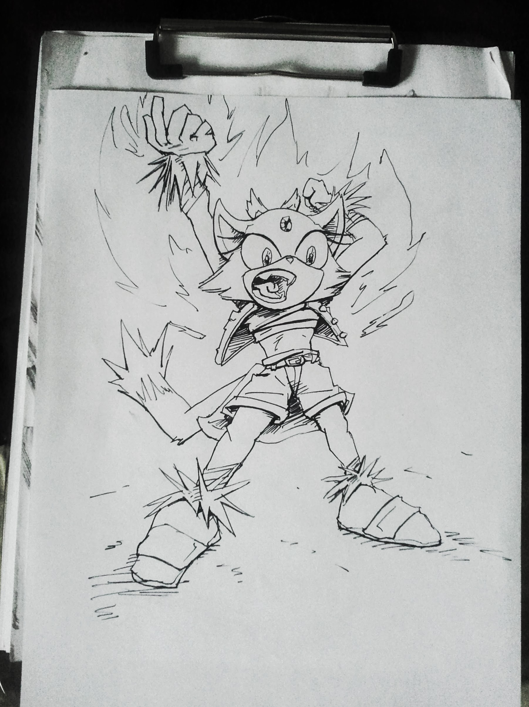

                
                
                
                                                                                        
                                                                                          

I think that the Sonic the Hedgehog 20th anniversary redesign was a missed opportunity for a more competent female protagonist.
 

                                    
                
                
                
                
                                
<small>source: https://saturdayxiii.tumblr.com/post/75910281418</small>