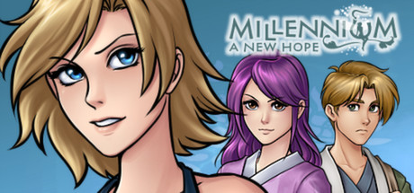

                                                                                          

<a href="https://store.steampowered.com/app/280140/Millennium__A_New_Hope/" target="_blank">Millennium a New Hope</a> must have done well as a high school project. Based on the writing and overload of anime/rpg tropes I assume that's what it was made for. I don't know why there are at least 5 of these Millennium games out there, but I think I have a pretty good idea why only one made it to Steam so far, and I'm quite surprised that it did.  This review is technically incomplete, because I haven't finished the game. Everything could change, but I doubt that I'm going to get there. I've been playing for 12 hours and have only obtained 4 out of 5 main characters. That's not a measure of judgment in itself, but I am bored enough to say that I probably won't play much more. Nothing is compelling me to play more.  As an RPG, this game does well in it's mechanics. It's got some interesting methods to power up your characters and lots of variety for weapons and enemies. The game play itself is actually quite commendable. &hellip; Except for the random jumping portions and other unseen elements, but you can't win them all.  Here's the clincher for me. This game is more of a first time fan fiction to JRPGs. All these comments towards the immaturity of the writing of the game is because nothing happens for any reason. Or at least for any understandable reason. What's the conflict? Big kingdom won't help struggling country side and wants them all to starve to death. Solution? Peasant girl is moved by squirrels helping each other and think that humans need to act more like squirrels (?). Every one is sure to help each other and get along if only she can become leader of the kingdom in its next election. The twist? Democracy has failed! The election is rigged. Plus no one would want to vote for her anyway, but that's not really addressed. Luckily the land has an ancient tradition for such times: "Martial Law". When elections don't go the way you want, find a posse and beat the hell out of people until they listen. If the game was trying to be ironic this would be great, but the sad music and dry story telling tell me it's trying to be heartfelt and inspiring.   So the story sucks, does this ruin the game? Not for everyone, sure, but the story is a major part of JRPG's and is especially important to this reviewer. What made me stop playing the game is the inane dialogue that happens every scene. I'm tired of clicking through a dozen text bubbles filled with 1 dimensional character banter complete with *chuckles* and *looks away sadly* remarks every time a task is finished or started. The characters aren't characters, they are tropes: ignorant, carefree, stubborn leader; sarcastic sidekick; cowardly tag-a-long; etc. and nothing in the miles of dialogue actually develops character or gives motivation. I only know that the characters have these personalities because the other characters say so. The cowardly tag-a-long seems quite reasonable to me. I was surprised to learn that the main character was "energetic" and carefree until she got sidekicks obsessed enough about her every idea and action to tell me so. Even the quests that every new character demands develop nothing for the characters or story.  Some people do like this game, and that's fine. Hardcore fans are probably more geared toward gameplay. Newbies probably appreciate the warm and simple storyline. Maybe something changes later that will actually grip me to want to progress, but I don't want to risk another 10 hours on such a low possibility.

 
 
                                    
                
                
                
                
                                
<small>source: https://saturdayxiii.tumblr.com/post/182014542454</small>