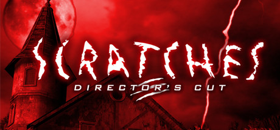

                                                                                          

I had watched a lets play of <a href="https://store.steampowered.com/app/46460/Scratches__Directors_Cut/" target="_blank">Scratches</a> and another mansion horror game: Pineview Drive. I wanted to give Pineview Drive a negative review because it sucks and is pointless, but that would mean having to pay for it. I already owned Scratches, so lets give this game a positive review instead.  This game is great.  Honestly it's not for everyone, but seriously it's great. Unlike Pineview Drive there is an actual story with real weight to it. Everything has a reason and a consequence, and it's meaningful to a character that you learn to care about.  The game is slow, dated interface and graphics, and requires a lot of reading without voice over. That's a drawback to most people, but it's atmosphere is great and meaningful. It has a couple puzzles and very few jump-scares but they are in places that actually matter to the story and give you a memorable experience unlike a certain other game.  Scratches has a heavy story with not a whole lot of game action, definitely not everyone is into that, but this game is beautifully catered to the people who are into that. Great atmosphere, very immersive, great story. 
 
                                    
                
                
                
                
                                
<small>source: https://saturdayxiii.tumblr.com/post/182014203904</small>