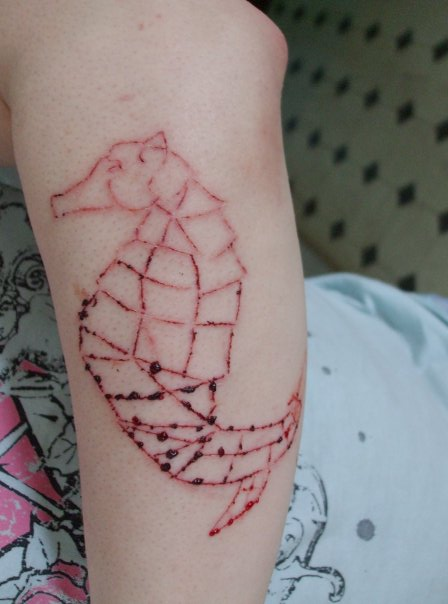

                                                                                          

Scarification is hard.  I had to do this every month, but couldn’t get myself to cut deep enough for the lines to stay.  After several months I just stick poked it with purple ink.  I guess that’s more my style.
 
                                    
                
                
                
                
                                
<small>source: https://saturdayxiii.tumblr.com/post/132020150369</small>