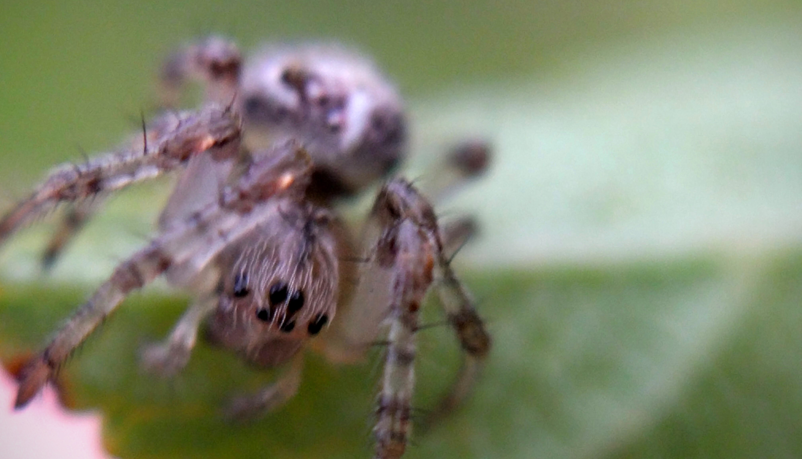
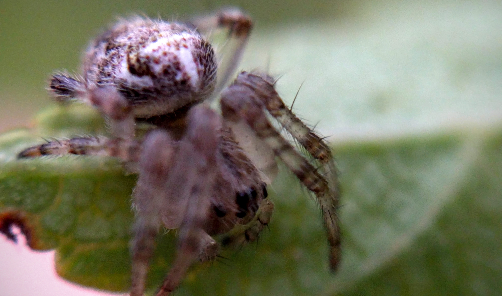
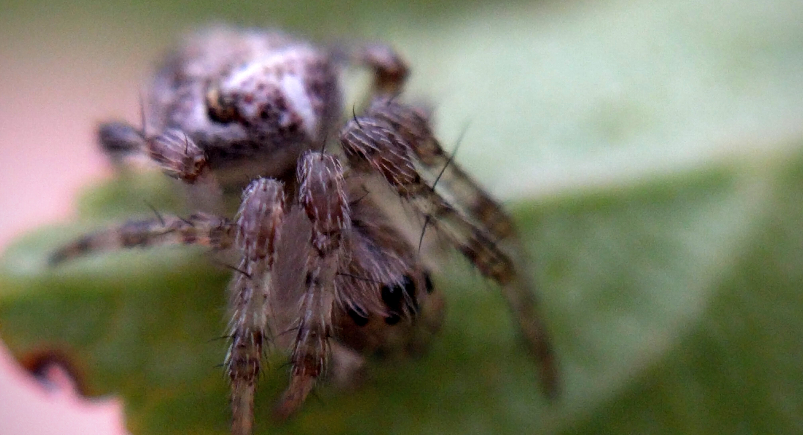

                               
                           

                                                                                                                           

                               
                           

                                                                                                                           

                               
                           

                                                                                                                           

                               
                           

                                                                                                                      

Once again the light was too low to give me enough focal range, but he’s still cute so you can pick the lesser of bad photos for yourself.
 
                                    
                
                
                
                
                                
<small>source: https://saturdayxiii.tumblr.com/post/149846307006</small>