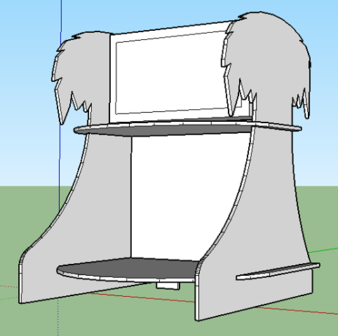

                
                
                
                                                                                        
                                                                                          

I was interested in trying to make a countertop arcade stand for Hotline Miami.  Unfortunately any device more expensive than a raspberry pi would be out of my budget, and it really doesn’t look like Hotline Miami can run on a pi.  Oh well.  I’m sure I can find something else and rework the design.
 

                                    
                
                
                
                
                                
<small>source: https://saturdayxiii.tumblr.com/post/158895318979</small>