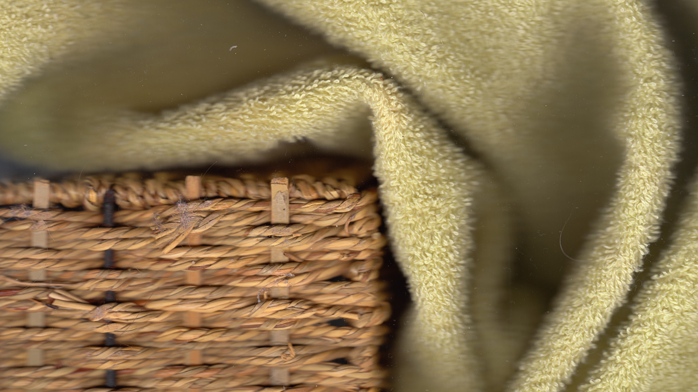

                
                
                
                                                                                        
                                                                                          

I was unofficially introduced to scannography years ago.  While I thought it was cool, I wasn’t especially attracted to it.  That’s changed.  I don’t know why, but the shallow depth of field and high detail is almost mesmerizing.  I’m super happy that I bought a Canon Lide 210 a couple years ago and have new use for it.  I can’t wait to experiment with it in the outside world.
 

                                    
                
                
                
                
                                
<small>source: https://saturdayxiii.tumblr.com/post/158990166644</small>