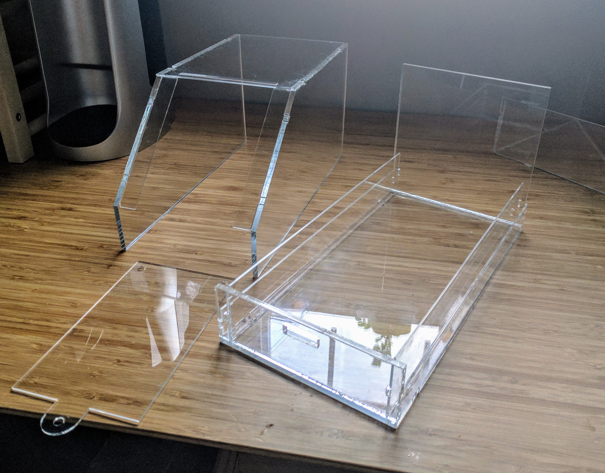
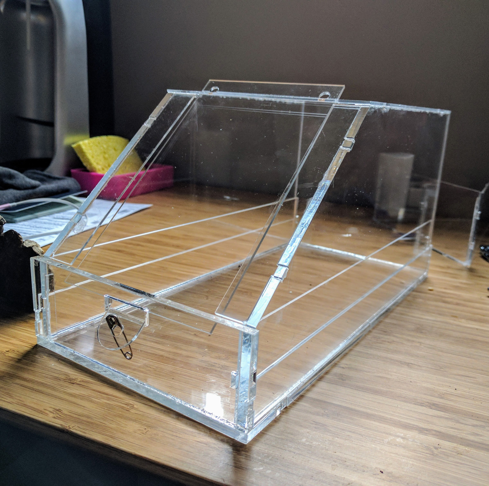
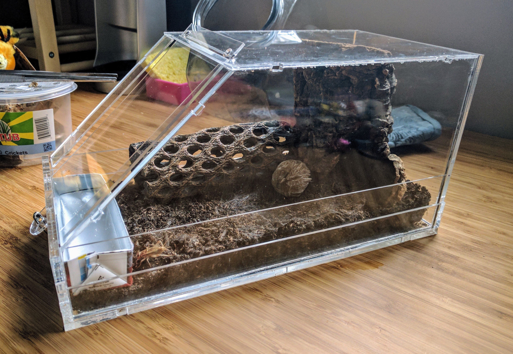

                
                
                
                                                                                       

                               
                           

                                                                                                                           

                               
                           

                                                                                                                           

                               
                           

                                                                                                                           

                               
                           

                                                                                                                           

                               
                           

                                                                                                                      

Finished product.  Needs a bit of improvement: a couple inches wider, lost some air holes somewhere but accidentally made some unplanned ones elsewhere.  Works out.
 

                                    
                
                
                
                
                                
<small>source: https://saturdayxiii.tumblr.com/post/160594157914</small>