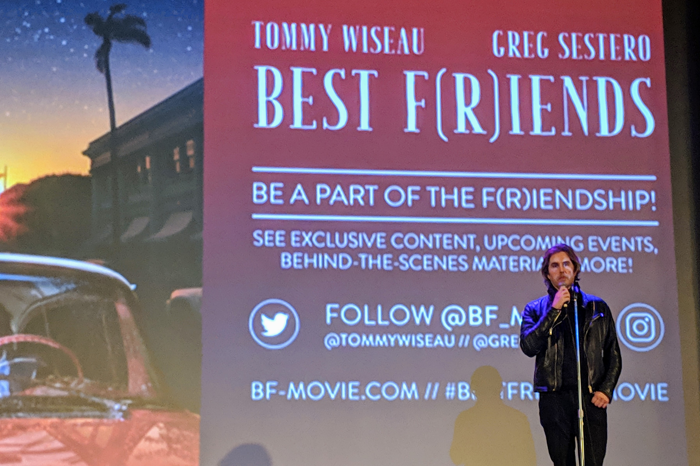

                
                
                
                                                                                        
                                                                                          

Went out to see Best F&reg;iends Volume One with Greg Sestero in audience.  It was rather on whim, and I feel bad for the local chiptune show that really could have used the support, but it was still alright.  Weird having leather-clad Greg step up and slyly jab a non-present Tommy, who remains essentially exactly the same character in this movie; a character who I assume is at its core Tommy Wiseau.  

The movie was decent too.  Probably the only kind of role that Tommy can genuinely play.  Movie came across as a very artsy production.  Greg admitted accurately that it was a long film, but they did a decent job keeping it entertaining.

I couldn’t bring myself to stay up for the sequel.
 

                                    
                
                
                
                
                                
<small>source: https://saturdayxiii.tumblr.com/post/181058445904</small>