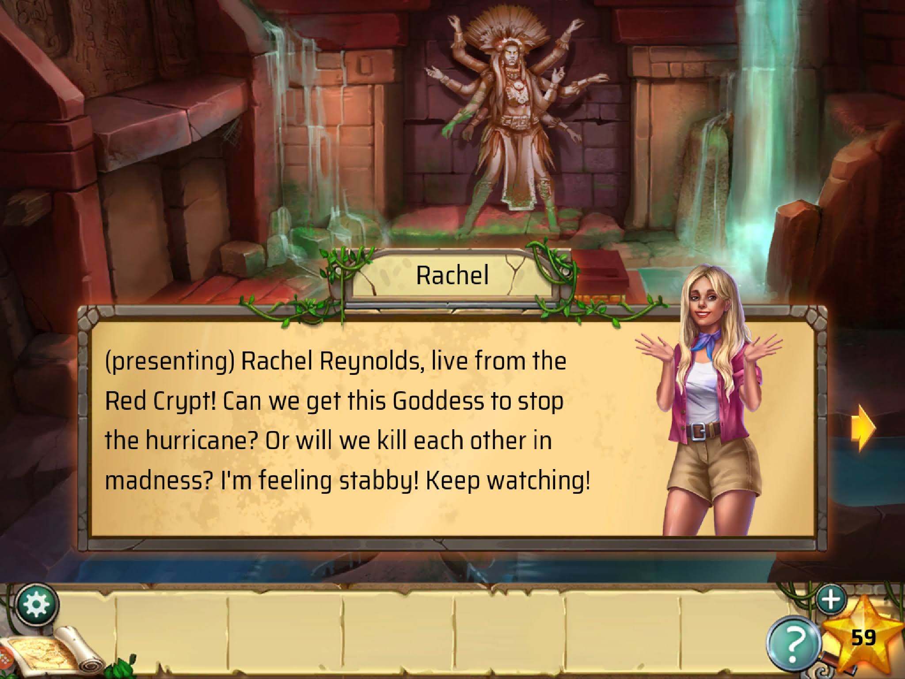

                
                
                
                                                                                        
                                                                                          

I fell in love with <a href="https://www.haikugamesco.com/" target="_blank">Haiku Games</a> for a little bit thanks to <a href="https://play.google.com/store/apps/details?id=com.haikugamesco.escape16&amp;hl" target="_blank">Dark Ruins</a>.  Few things have such a negative stimga these days as mobile games and modernized point and click adventure, but the markets are massive.  People want to love these games.  So when a publisher shows some competence, their products really shine.  

Definitely keep an eye on <a href="https://www.haikugamesco.com/blog" target="_blank">Haiku Games’s blog</a> if you’re interested in indie studios specializing in mobile games.  Their gleams into behind the scenes hit all the right inspirational notes for me.  I haven't played a lot of their catalogue, but even they seem to express that Dark Ruins is cream of their crop.  I hope they take what they’ve learned from it and apply it to all their future games.

Dark Ruins stands out mainly due to the screen time they give their characters.  This caught me the most off guard as I’ve come to expect casual game characters to be nothing more than placeholders for story elements.  Unfortunately not all the characters are so developed, as the ones I expected to like quickly fell to the wayside; while the popular-media-crazy-teen-girl archtype, that I normally detest in any form, gradually turned into a character that I eagerly awaited more lines from and actually kind of gave a damn about her livestream.  That demonstrates some fine writing craftmanship imo.  

An often neglected aspect of puzzle games is often the puzzles themselves, but I have to say that Dark Ruins is probably one of the only adventure games where the puzzles nearly always made a logical sense.  There still is that kind of nonsense where you’re counting natural chips in the decor, or bits of scenery in the background to work out the code on combination locks, but from a puzzle mechanic stand point the clues always made sense.  Not that it was easy.  I did require a walkthrough every so often, which it would then hit me over the head with how I wasn’t paying close enough attention.  The clues are clear and logical.  With better pacing I probably wouldn’t have needed the walkthrough at all.  Also nearly every puzzle came with a clever twist for that last clue which kept me on my toes and helped prevent puzzle burnout.
<a href="https://66.media.tumblr.com/1d4e5695af5335726dbb58508fbe6830/tumblr_inline_pl4zeeW36S1rnrp45_1280.jpg" target='_blank"'><figure data-orig-width="2048" data-orig-height="1536" class="tmblr-full"></figure></a>
Soooo, this still is a casual point-and-click puzzle game.  If you absolutely detest them, then know that this game isn’t breaking any new ground to win your heart.  However, if you’re open to them, then this one is definitely worth some hype.  And God knows I hate hype.
 

                                    
                
                
                
                
                                
<small>source: https://saturdayxiii.tumblr.com/post/181907012504</small>