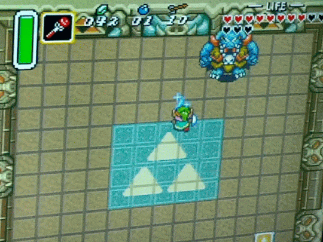

                
                
                
                                                                                        
                                                                                          

I watched most of the waking hours of AGDQ this year.  I have a growing disinterest that I assume is coming from over-familiarity.  But my favorite part, which challenged that notion, was the <a href="https://youtu.be/Gcbhkqub6ZI" target="_blank">legend of Zelda: Link to the Past</a> segment.  It was a positive experience with a lot of close calls.  I also enjoyed the <a href="https://youtu.be/rbyV3MCR9xk" target="_blank">super Metroid</a> finale.  Maybe it just took me all week to get into it?
 

                                    
                
                
                
                
                                
<small>source: https://saturdayxiii.tumblr.com/post/181997321324</small>