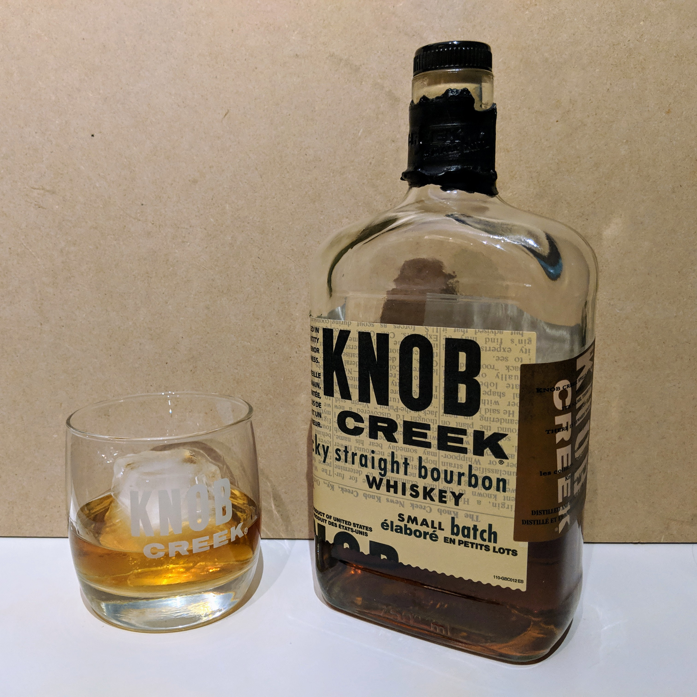

                
                
                
                                                                                        
                                                                                          

Christmas whiskey.  First time having Knob Creek.  It's super sharp, especially with ice.  I've gone through most of the bottle by now and I'm regretting drinking it with ice so often&hellip; Including this time.  I had a taste as soon as I poured it and I thought the whiskey had aged since I last had it.  Now its settled and it tastes like the other times.  For a brief second there it was more bold and full bodied with a slightly peat ending.  Almost Dark Horse like (my absolute favorite). I'll have to remember that next pour.

It came with a custom glass! Which has fast become a favorite of mine.  Fat bottom glass make my rockin world go round.
 

                                    
                
                
                
                
                                
<small>source: https://saturdayxiii.tumblr.com/post/181884034944</small>