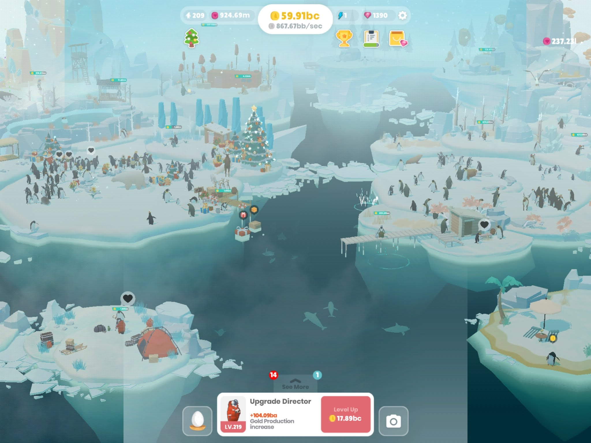

                
                
                
                                                                                        
                                                                                          

I put a lot of time into Penguin Isle, so I wanted to talk about it.  But what is there to say other than I’m a sucker?

If you like this kind of watch-ads-and-tap-tap gameplay, this game should be your jam too.  I wouldn’t be surprised if this was the same company that made Abyssrium, or whatever they call it now.  As it is the same game, even some of the models appear to be the same.  Something to note that might be common knowledge by now.  Always upgrade the fishing spot.  Whenever you can. It’s the one that achievements hang with.  For the lightening bolt upgrades, always do creation first, unless there’s an upgrade that you specifically want to benefit from right then.  Also, make sure you claim your achievement lightning bolt things as soon as they pop up.  You don’t want to open a chest, find out you need to open a chest, then have to wait for the next one to emerge.  I played this when a whale gave you coins.  I don’t know what they replaced it with.  I quit when I got all the islands, and I don’t want to know what else has been added because I don’t want to get trapped again.  Tap tap. 
 

                                    
                
                
                
                
                                
<small>source: https://saturdayxiii.tumblr.com/post/190407682119</small>