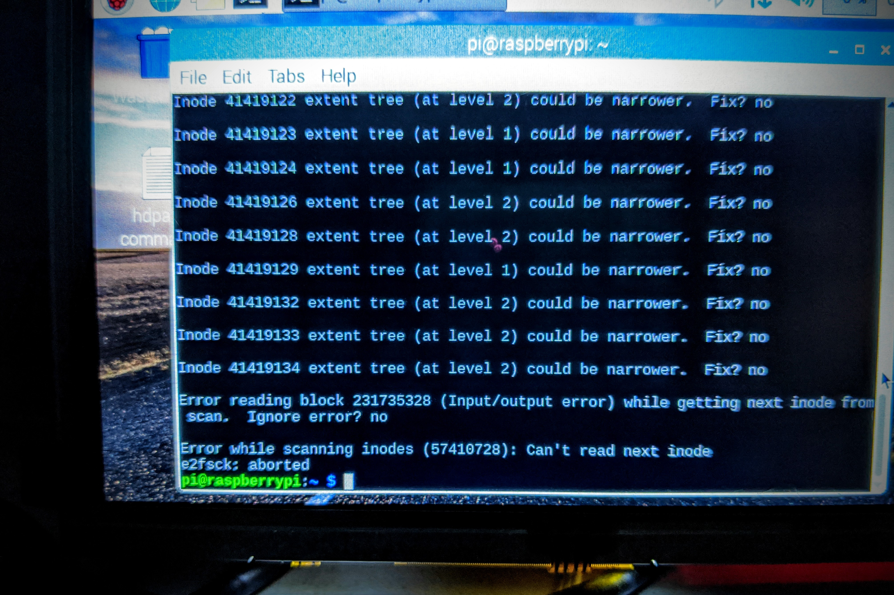

                
                
                
                                                                                        
                                                                                          

A big reminder to myself not to run disk checks/repairs on a glitchy hdd before attempting absolutely everything to get the files off.  RIP lossless, extended Escaflowne movie ost. 

A detailed account in hopes that I don’t forget: I had a large EXT4 HDD disappear off my Rpi nas (lol, so l337).  Restarted a couple times with no change.  Plugged in the drive after a bootup and got an error saying that the mount point was already taken.  Remove the drive from fstab and the error persists, but oddly enough the drive still shows up in the file manager, albeit devoid of content.

Enter command line, where accessing the directory straight up tells me there’s read/write errors.  Dmesg barely elaborates by saying there’s a “medium critical” error, and everything online says to run e2fsck to fix the errors.  Well, attempting a safe run with e2fsck couldn’t complete, so I just had to say “y” to everything and now I have thousands of unnamed files to sort through.  What I wish I knew was that I could have plugged the drive into my Windows machine and used ext2fsd to transfer the named files. Then flat out reformatting the corrupted drive would have been a simpler process.  I learned this because after renaming a good chunk of the recovered files, I shut down the system and waited for my replacement drive to arrive in the mail.  Upon boot up, that drive as well as a second one had become corrupted.  Apparently the USB hub which worked great for 4 years decided to start killing off my data, and I had to move over to my Windows machine to have enough ports for transferring.  One more caveat though: it seems e2fsck doesn’t handle non-english characters well.  I don’t know what the exact conditions are, because some files made it through, but about 80% of my files with Japanese names, or accented é’s just didn’t show up in the explorer.   

I’m now prepared to do proper back ups, but really, maybe it’s time I just stopped being such a digital horder.  Honestly, I use enough streaming media that I rarely go through my personal files. but still I’m worried that one day after the apocalypse of online entertainment services, I’ll desperately want to play that drm-free copy of Witcher 2.   Here’s hoping there’s still compatibility tutorials to get it working on Windows XX. 
 

                                    
                
                
                
                
                                
<small>source: https://saturdayxiii.tumblr.com/post/190913838744</small>