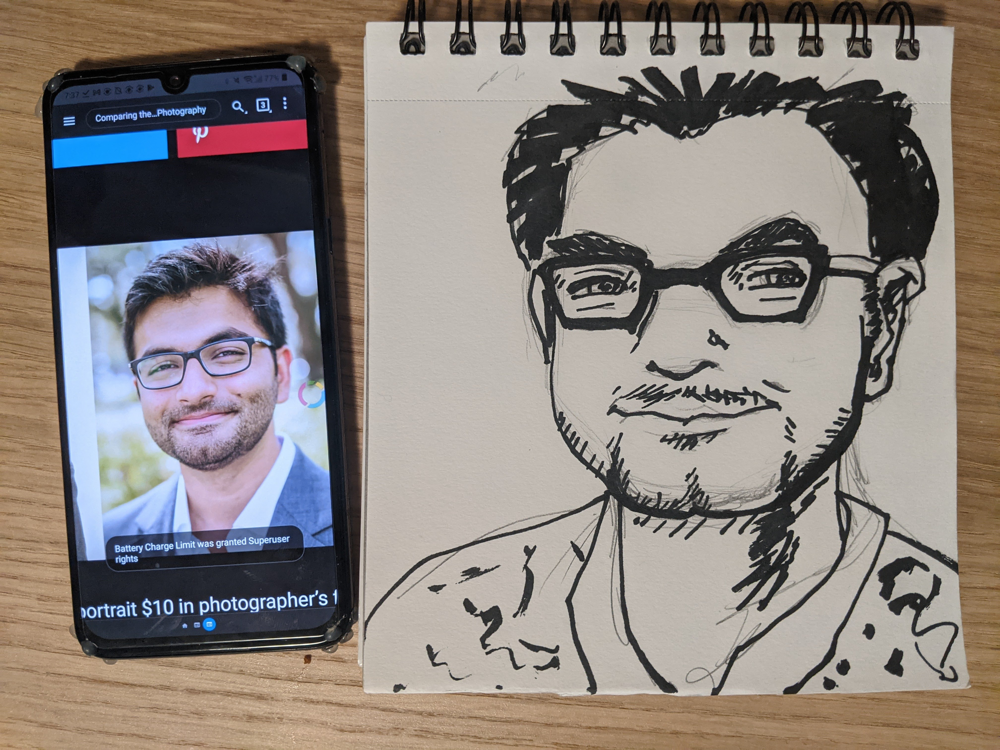
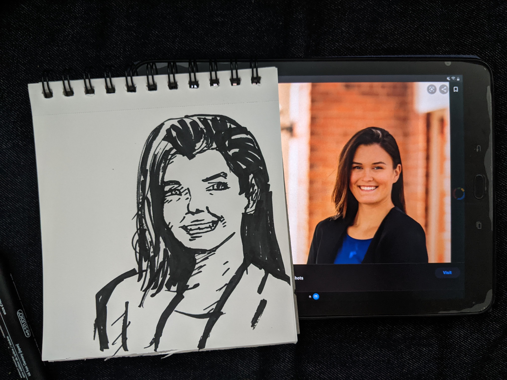
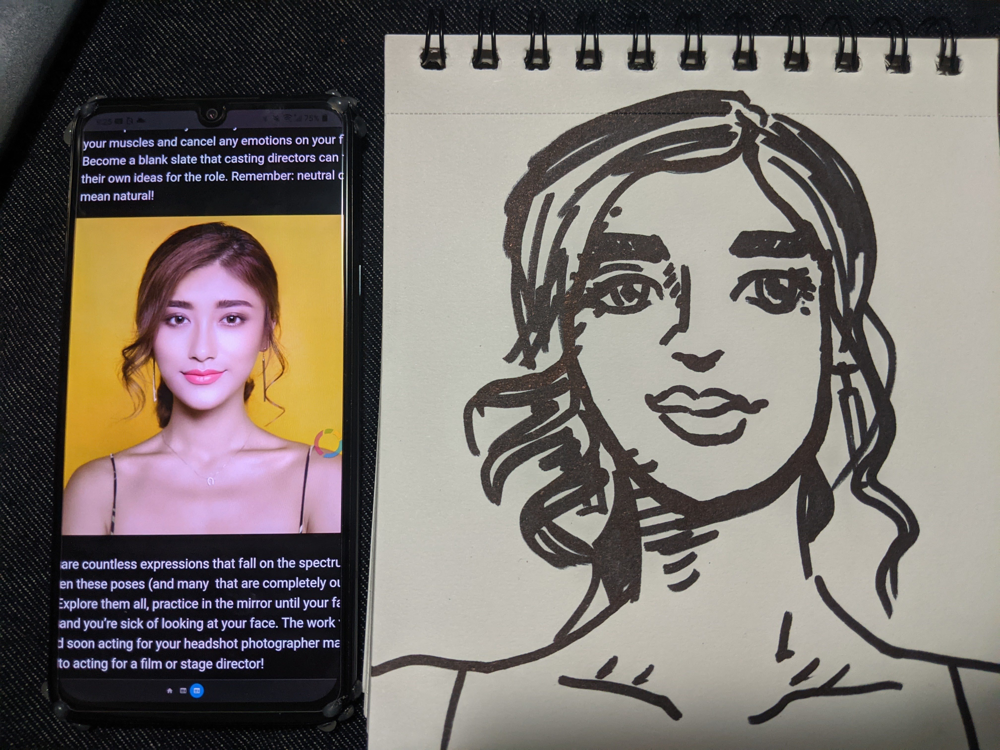
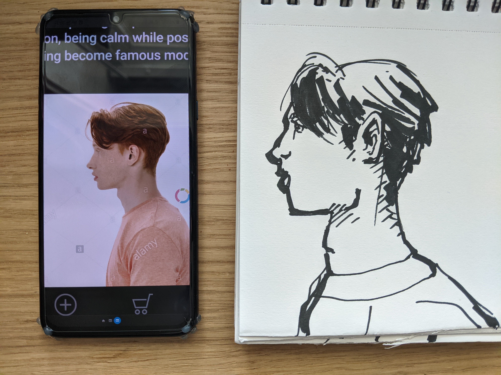
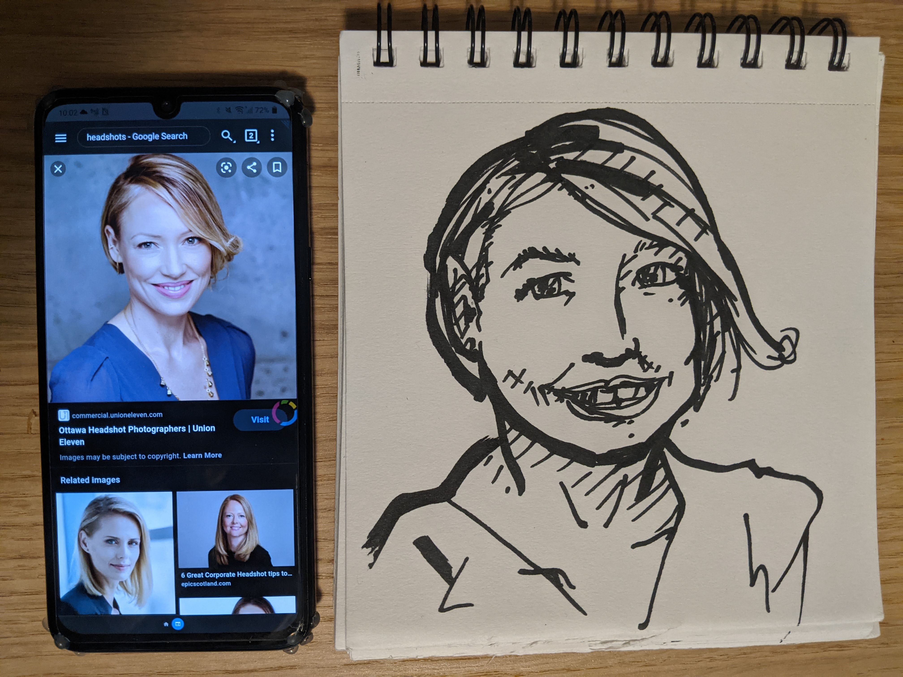
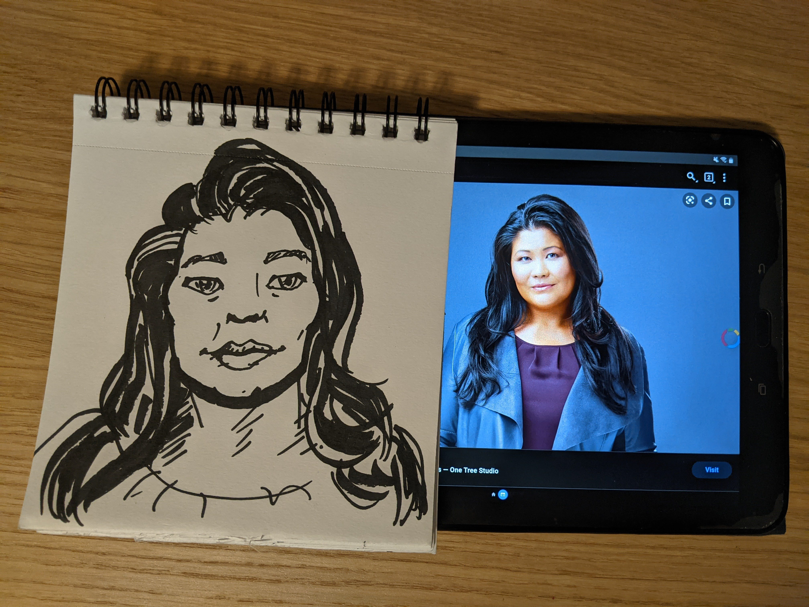
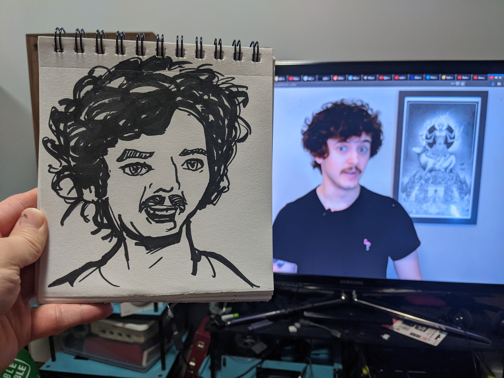
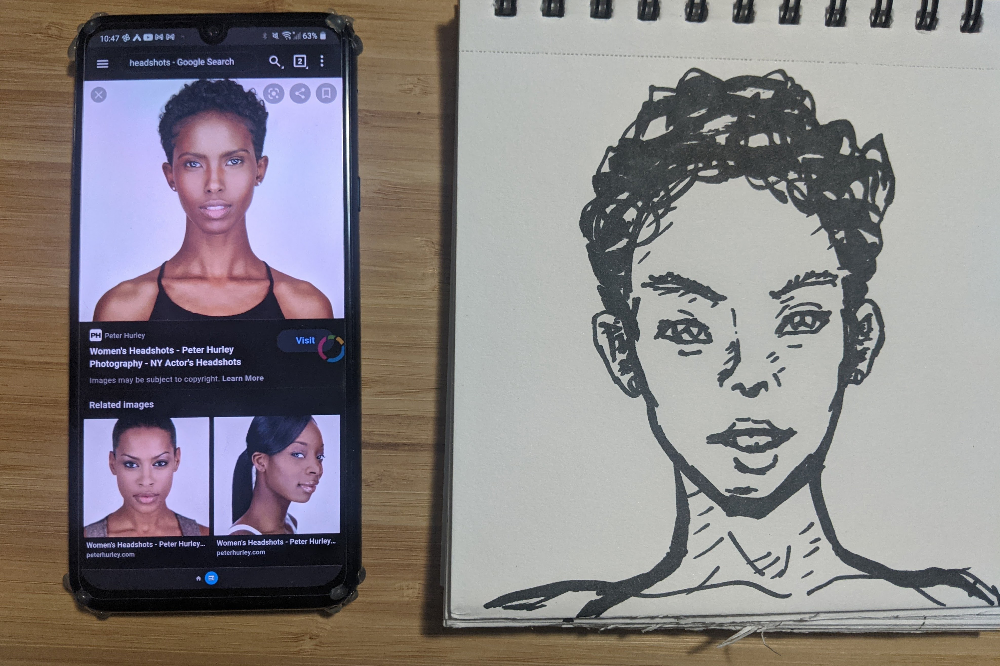
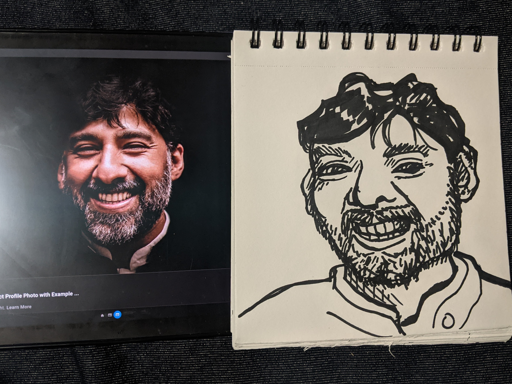

                               
                           

                                                                                                                           

                               
                           

                                                                                                                           

                               
                           

                                                                                                                           

                               
                           

                                                                                                                           

                               
                           

                                                                                                                           

                               
                           

                                                                                                                           

                               
                           

                                                                                                                           

                               
                           

                                                                                                                           

                               
                           

                                                                                                                           

                               
                           

                                                                                                                      

Here’s a week of progress.  Drawing at least one quick portrait every day.  I’ve gotten more used to my tool of choice.  Now if only I could be a better artist.

I am feeling a little more controlled.  Feeling more successful in small areas.  I’ll keep it up and see what happens.

I really think I’m on to something with these small 20 minute projects.  At least if I can actually get a sense of some consistency across them.  Normally my art projects take 4-6 hours easily, but I think there’s too many elements in one piece for me to absorb much growth.  Then I also do them a lot less often because they take so much effort.  We’ll see if I can stick to this, and maybe I can even apply it to other creative areas I want to do more of. 
 

                                    
                
                
                
                
                                
<small>source: https://saturdayxiii.tumblr.com/post/646509339504443392</small>